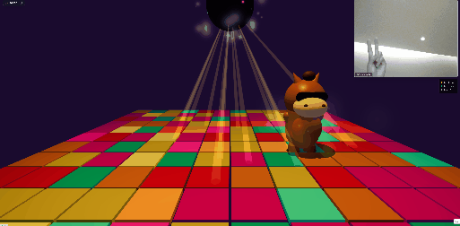

Creative Commons Attribution-NonCommercial 4.0 International License (CC BY-NC 4.0)

Copyright (c) 2026 Yan Shu (舒龑) madjojoshuyan

This work is licensed under a Creative Commons Attribution-NonCommercial 4.0 International License.

=== You are free to: ===

* Share — copy and redistribute the material in any medium or format
* Adapt — remix, transform, and build upon the material

The licensor cannot revoke these freedoms as long as you follow the license terms.

=== Under the following terms: ===

* Attribution — You must give appropriate credit, provide a link to the license, and indicate if changes were made. You may do so in any reasonable manner, but not in any way that suggests the licensor endorses you or your use.

* NonCommercial — You may NOT use the material for commercial purposes. This means you cannot sell this project, include it in a paid video game, use it in a monetized app, or use it to generate revenue in any way.

=== No additional restrictions === 
You may not apply legal terms or technological measures that legally restrict others from doing anything the license permits.

------------------------------------------------------------------------
For the full, legally binding text of this license, please visit:
https://creativecommons.org/licenses/by-nc/4.0/legalcode

> Release date: 2026-03-08
> Base version: v0.0.0
> Files: 
>

* .env.local
* .gitignore
* App.tsx
* components

  * Controls.tsx
  * DiscoScene.tsx

* index.css
* index.html
* index.tsx
* metadata.json
* package-lock.json
* package.json
* services

  * audioService.ts
  * visionService.ts

* tsconfig.json
* types.ts
* vite.config.ts

> \\\\\\\\\\\\\\\\\\\\\\\\\\\\\\\*\\\\\\\\\\\\\\\\\\\\\\\\\\\\\\\*Base Version Developer:\\\\\\\\\\\\\\\\\\\\\\\\\\\\\\\*\\\\\\\\\\\\\\\\\\\\\\\\\\\\\\\* Yan Shu (舒龑)
> \\\\\\\\\\\\\\\\\\\\\\\\\\\\\\\*\\\\\\\\\\\\\\\\\\\\\\\\\\\\\\\*Last Updated By:\\\\\\\\\\\\\\\\\\\\\\\\\\\\\\\*\\\\\\\\\\\\\\\\\\\\\\\\\\\\\\\* Yan Shu (舒龑)

# Here are the detailed, step-by-step instructions to get the app running locally on your computer:

##### Step 1: Install Node.js

Node.js is required to run the development server and install the project's dependencies.
Open your web browser and go to [nodejs.org](nodejs.org).
Click the button to download the "LTS" (Long Term Support) version.
Open the downloaded installer file and follow the installation wizard (you can keep all the default settings by just clicking "Next" until it finishes).

##### Step 2: Open your Project Folder in a Terminal

You need to open a command line interface inside the folder where you extracted the code.
If you are on Windows:
Open the folder where you extracted all the code using File Explorer.
Click on the address bar at the top of the File Explorer window.
Type cmd and press Enter on your keyboard. This will open a black Command Prompt window directly in that folder.
If you are on a Mac:
Open the folder where you extracted all the code using Finder.
Right-click the folder (or click the gear icon at the top of the window) and select New Terminal at Folder.

##### Step 3: Install Dependencies

Now you need to download the required libraries (like React, Three.js, and Tailwind CSS) into your project.
In the terminal window you just opened, type the following command:
code

|Bash|
|-|
|npm install|

Press Enter.
Wait for the installation to finish. You will see a progress bar, and it will create a new node\_modules folder in your directory.

##### Step 4: Start the Development Server

Once the installation is complete, you can start the local server.
In the same terminal window, type the following command:

code

|Bash|
|-|
|npm run dev|

Press Enter.
You will see output indicating the server has started, which usually looks something like this:

code

|Text|
|-|
|VITE v6.2.0  ready in 500 ms ➜  Local:   http://localhost:3000/|

##### 

Step 5: Open the App in your Browser

Open your web browser (Chrome, Edge, Safari, etc.).
Click on the address bar at the top, type http://localhost:3000 (or whatever URL the terminal showed you), and press Enter.
The app should now load successfully!
(Note: Keep the terminal window open while you are using the app. If you close the terminal, the local server will stop running. To stop the server manually, you can click inside the terminal and press Ctrl + C on your keyboard).

